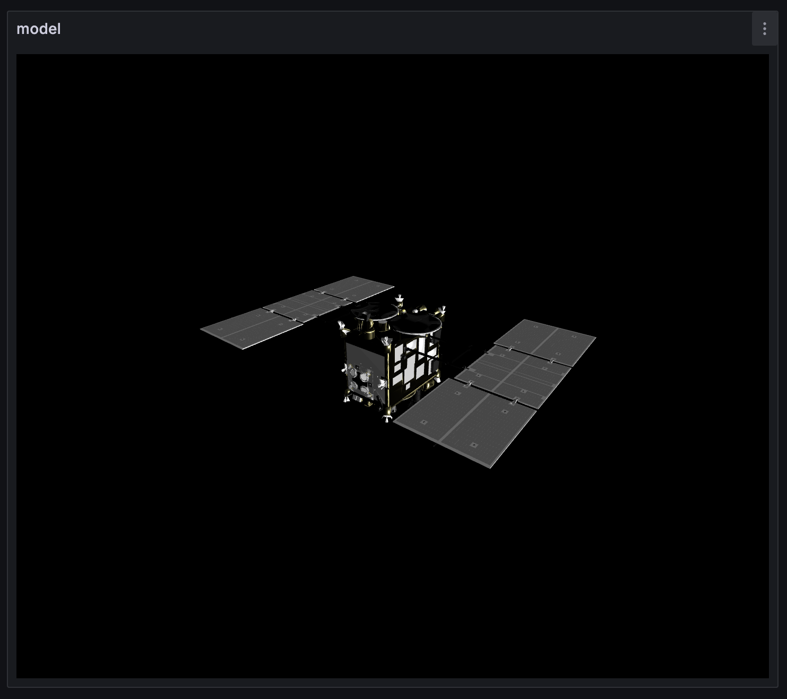
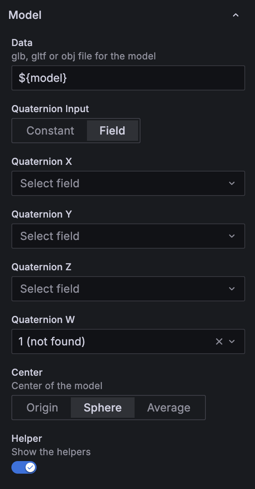
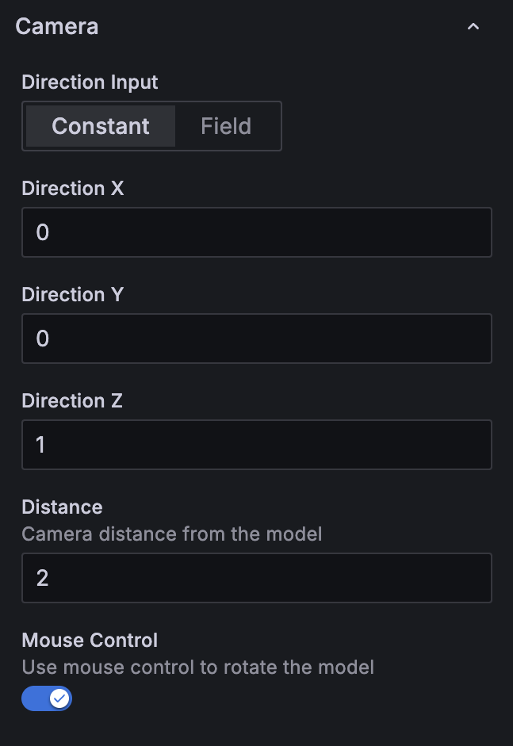
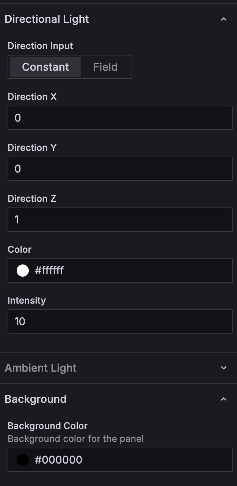

# Attitude 3D Panel for Grafana

A panel plugin for displaying 3D model data using WebGL.

Render WebGL-based 3D models directly inside Grafana dashboards. The panel is ideal for monitoring spacecraft attitude, robot pose, or any sensor-driven 3D visualization.

## Highlights

- Load GLB, GLTF, or OBJ assets and bind quaternion updates to live telemetry.
- Tune camera placement, distance, and mouse interactions for inspections or demos.
- Combine directional and ambient lighting to match the conditions your model represents.
- Align the pivot, helper axes, and background to keep orientation easy to understand.

## Installation

1. Install dependencies with `pnpm install` (see `package.json`).
2. Build the plugin bundle via `pnpm build`.
3. Copy or symlink the plugin folder into your Grafana plugin directory (for development use `grafana-server`'s `plugins` path).
4. Restart Grafana and enable the unsigned plugin from the configuration page if required.

## Usage Workflow

- **Provide a model asset**: Host your `.glb`, `.gltf`, or `.obj` file where Grafana can reach it. The URL can include Grafana template variables.
- **Bind quaternion data**: Choose *Constant* for fixed orientation or *Field* to bind to real-time data frames.
- **Center the model**: Switch between origin, bounding sphere, or average vertex center depending on your asset's coordinate system.
- **Calibrate the camera**: Use the camera direction vector and relative distance (where the farthest vertex equals 1) to keep the frame consistent.
- **Shape the lighting**: Adjust directional light vectors, colors, and intensity, then blend in ambient light for shadow fill.
- **Expose helpers and controls**: Toggle helper axes during debugging and enable mouse control for interactive reviews.

## Panel Options

### Model

*Panel view — select the mesh source, choose how to feed quaternion values, and define the pivot helper.*

- **Data**: URL or template-variable path to a GLB, GLTF, or OBJ asset. The hosting server must respond to CORS preflight requests.
- **Quaternion Input**: Choose *Constant* or *Field* to define how the quaternion parameters are sourced.
- **Quaternion X / Y / Z / W**: Quaternion values applied to the model pivot.
- **Center**: Use origin, bounding sphere center, or averaged vertices to realign the model.
- **Helper**: Show helper axes to visualize the pre-rotation frame.

### Camera

*Panel view — point the camera via constants or fields and enable mouse-driven orbital controls.*

- **Direction Input**: Provide constants or bind to fields for the camera direction vector.
- **Direction X / Y / Z**: Components of the camera direction.
- **Distance**: Relative distance from the model (1 equals the farthest vertex from the center).
- **Mouse Control**: Enable orbit-style camera control for exploratory inspection.

### Directional Light

*Panel view — balance directional and ambient light to keep the model legible.*

- **Direction Input**: Choose constants or data-bound vectors for light direction.
- **Direction X / Y / Z**: Components of the directional light vector.
- **Color & Intensity**: Tune light temperature and brightness.

### Ambient Light

- **Color & Intensity**: Adjust global ambient illumination.

### Background & Helpers

- **Background Color**: Pick a solid background or set to transparent for overlay views.
- **Helper Axes**: Toggle helper axes to debug the local coordinate frame.

## Development

- Run `pnpm dev` to watch for code changes during plugin development.
- Execute `pnpm test` for unit tests and `pnpm playwright test` for UI regression coverage.
- Follow Grafana plugin signing guidelines before distributing binaries.

## Localization

A Japanese translation of this README is available in `README_ja.md`.

## License
Licensed under the GNU Lesser General Public License v3.0.

© 2025 ISAS/JAXA and [NAKAHIRA, Satoshi](https://orcid.org/0000-0001-9307-046X).

