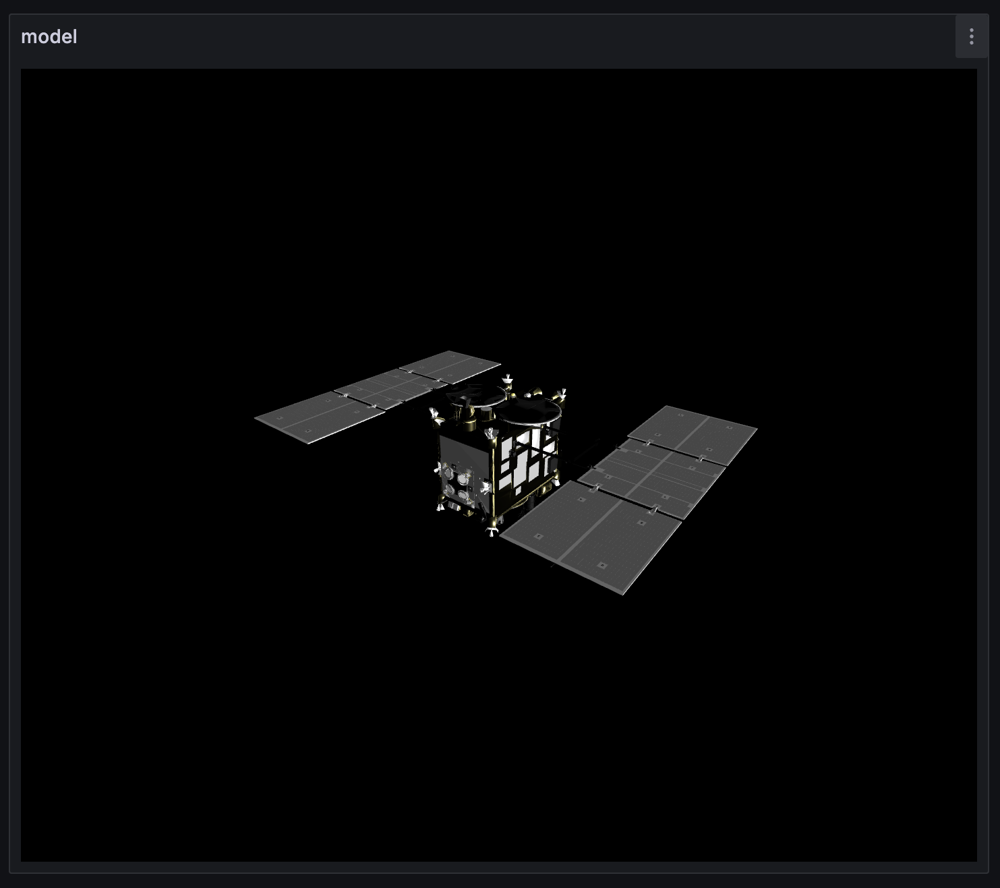
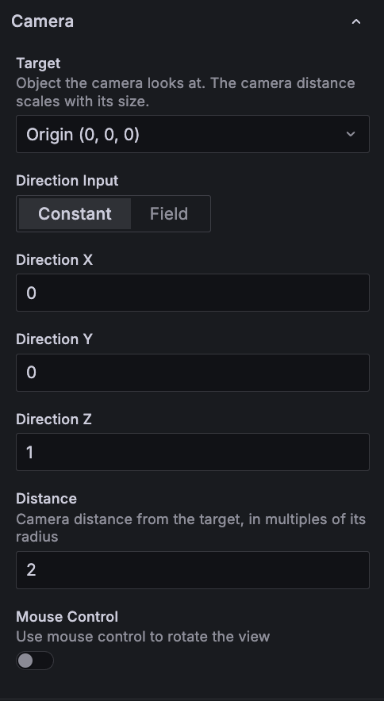
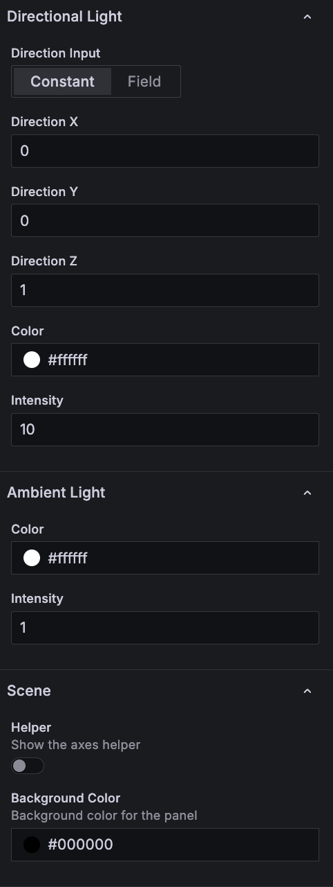
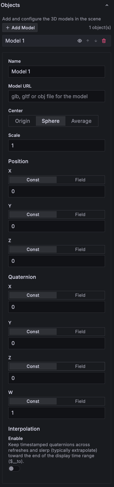
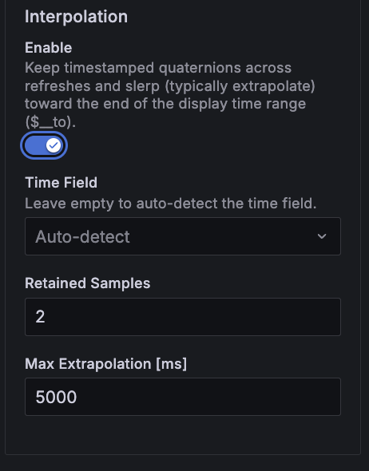

# Attitude 3D Panel for Grafana

A panel plugin for displaying 3D model data using WebGL.

Render WebGL-based 3D models directly inside Grafana dashboards. The panel is ideal for monitoring spacecraft attitude, robot pose, or any sensor-driven 3D visualization.

## Highlights

- Place **any number of 3D models** in one scene, each with its own asset, position, and orientation.
- Load GLB, GLTF, or OBJ assets and bind position and quaternion to live telemetry, per model.
- Point the camera at the origin or at **any model**, and let the look-at point follow it as it moves.
- Keep models moving smoothly between refreshes with per-model **quaternion interpolation / extrapolation**.
- Combine directional and ambient lighting to match the conditions your model represents.
- Align each model's pivot, and toggle helper axes and background to keep orientation easy to understand.

Dashboards built with the earlier single-model version are **migrated automatically** — see [Migration](#migration).

## Installation

1. Install dependencies with `pnpm install` (see `package.json`).
2. Build the plugin bundle via `pnpm build`.
3. Copy or symlink the plugin folder into your Grafana plugin directory (for development use `grafana-server`'s `plugins` path).
4. Restart Grafana and enable the unsigned plugin from the configuration page if required.

## Usage Workflow

- **Add a model**: Press *Add Model* under **Objects**. Each model gets its own settings; pick one in the list on the left to edit it on the right.
- **Provide a model asset**: Host your `.glb`, `.gltf`, or `.obj` file where Grafana can reach it. The URL can include Grafana template variables.
- **Bind position and quaternion data**: Each of Position X/Y/Z and Quaternion X/Y/Z/W is independently either a *Const* or a *Field*.
- **Center the model**: Switch between origin, bounding sphere, or average vertex center depending on your asset's coordinate system.
- **Calibrate the camera**: Choose the target to look at, then set the direction vector and the relative distance (the target's bounding-sphere radius equals 1).
- **Smooth out the motion**: Enable per-model interpolation to keep the attitude advancing between dashboard refreshes.
- **Shape the lighting**: Adjust directional light vectors, colors, and intensity, then blend in ambient light for shadow fill.
- **Expose helpers and controls**: Toggle helper axes during debugging and enable mouse control for interactive reviews.

## Panel Options

### Camera

*Panel view — pick what the camera looks at, point it via constants or fields, and enable mouse-driven orbital controls.*

- **Target**: The object the camera looks at — `Origin (0, 0, 0)` or one of the models added under Objects. The camera distance scales with the target's bounding-sphere radius, and the look-at point follows the target as it moves. With `Origin`, the distance is based on a sphere enclosing every visible model.
- **Direction Input**: Provide constants or bind to fields for the camera direction vector.
- **Direction X / Y / Z**: Components of the camera direction.
- **Distance**: Relative distance from the target (1 equals the target's bounding-sphere radius).
- **Mouse Control**: Enable orbit-style camera control for exploratory inspection.

### Directional Light

*Panel view — balance directional and ambient light to keep the model legible, then set the helper axes and background under Scene.*

- **Direction Input**: Choose constants or data-bound vectors for light direction.
- **Direction X / Y / Z**: Components of the directional light vector.
- **Color & Intensity**: Tune light temperature and brightness.

### Ambient Light

- **Color & Intensity**: Adjust global ambient illumination.

### Scene

- **Helper**: Toggle helper axes to debug the world coordinate frame.
- **Background Color**: Pick a solid background or set to transparent for overlay views.

### Objects

*Panel view — add models to the scene, then bind each one's asset, position, and quaternion.*

- **Add Model**: Add a new 3D model to the scene. The list below shows every model; select one to edit it, use the eye icon to hide it, the arrows to reorder, and the trash icon to remove it.

Each model has the following settings:

- **Name**: Display name, shown in the object list and used as a *Camera → Target* option.
- **Model URL**: URL or template-variable path to a GLB, GLTF, or OBJ asset. The hosting server must respond to CORS preflight requests.
- **Center**: Realign the asset using its *Origin*, its bounding *Sphere* center, or the *Average* of its vertices.
- **Scale**: Scale factor applied to the model.
- **Position X / Y / Z**: Position of the model in world coordinates.
- **Quaternion X / Y / Z / W**: Orientation applied to the model.
- **Interpolation**: See [Quaternion Interpolation](#quaternion-interpolation).

Position X/Y/Z and Quaternion X/Y/Z/W each choose their own source:

- **Const**: A fixed numeric value.
- **Field**: A value read from a query field, taking the latest row. The field can be given either as `Series.Field` (for example `A.q_x`) or as a bare field name (`q_x`). When more than one query returns a field of the same name, use the `Series.Field` form to disambiguate.

## Quaternion Interpolation

Configured **per model**, under that model's *Attitude Interpolation* settings in **Objects**.

*Panel view — enable interpolation to keep a model turning between dashboard refreshes.*

Grafana delivers data in discrete refreshes, so an attitude bound directly to a field only moves when new data arrives. With interpolation enabled, the panel retains a small number of timestamped quaternions across refreshes and spherically interpolates — in the usual case, *extrapolates* — to the end of the display range, so the model keeps turning smoothly between refreshes.

- **Enable**: Turn the behaviour on. Default: off.
  - Only takes effect when Quaternion X, Y, Z, and W are **all** set to *Field*. If any of them is a *Const*, there is nothing to sample and interpolation stays off.
  - When the display range is relative (for example `now-5m` to `now`), the extrapolation target advances every frame by the time elapsed since the data arrived.
- **Time Field**: Time field used for the retained quaternion samples. Leave empty to auto-detect the time field of the target frame.
- **Retained Samples**: Number of timestamped quaternions retained across refreshes. `2` gives constant angular-velocity extrapolation. Default: `2`.
- **Catch-up Blend [ms]**: When a new sample shifts which pair of points backs the extrapolation, blend into the corrected orientation over this many ms instead of snapping onto it. `0` disables blending. Default: `300`.

### How it works

**On each refresh**, the panel finds the frame that carries all four quaternion fields, takes its last *Retained Samples* rows, pairs each with the corresponding time value, normalizes the quaternions, and keeps them sorted by time. Nothing older is retained, so the memory cost is fixed regardless of how long the dashboard stays open.

**On each animation frame**, the panel picks a target time and samples the retained buffer at it:

1. **Target time.** The end of the display range (`${__to}`). If the range is relative — anything starting with `now` — the target additionally advances by the wall-clock time elapsed since the data arrived, so it keeps tracking "now" between refreshes rather than freezing at the last refresh instant.
2. **Pick a pair.** If the target is at or past the newest sample — the usual case — the last two samples are used. Otherwise the bracketing pair around the target is used, which makes the motion inside the retained window a piecewise slerp. There is no cap on how far past the newest sample the target can go: a stalled data source keeps extrapolating at the last known rate indefinitely rather than freezing.
3. **Slerp.** With `u = (target - a.t) / (b.t - a.t)`, the result is `slerp(a, b, u)`. Three.js implements slerp with the great-circle formula, so `u > 1` continues along the same great circle at the same angular velocity and the result stays a unit quaternion — no renormalization drift, no gimbal artifacts.
4. **Catch-up blend.** Whenever a new sample changes the pair of points backing the extrapolation, the *previous* pair is frozen and kept extrapolating in parallel with the newly corrected trajectory. The displayed orientation is `slerp(old, new, ratio)`, with `ratio` easing 0 → 1 (smoothstep) over *Catch-up Blend [ms]* — matching the old trajectory exactly at the start of the blend and the corrected one exactly at the end, so a mid-flight rate change doesn't look like a jump-cut.

With the default *Retained Samples* of `2`, this is exactly constant-angular-velocity extrapolation from the two newest attitudes. Raising it does not smooth the extrapolation any further — the leading pair still drives it — but it does let the panel interpolate correctly if the target time falls back inside the retained window.

Two degenerate cases are handled without special configuration: a buffer holding a single sample simply applies that attitude, and a pair less than 1 ms apart applies the newer one rather than dividing by a near-zero interval.

## Migration

Dashboards created with the previous, single-model version of this panel are migrated automatically the first time the panel is opened. The old `Model URL` / `Center` / Quaternion X..W / Quaternion Interpolation settings are converted into a single object named `Model 1`, its position is set to (0, 0, 0), and the Camera Target is set to `Origin` — so the panel looks exactly the same as before. Camera, lighting, and background settings are carried over untouched.

## Development

- Run `pnpm dev` to watch for code changes during plugin development.
- Execute `pnpm test` for unit tests and `pnpm playwright test` for UI regression coverage.
- Follow Grafana plugin signing guidelines before distributing binaries.

## Localization

A Japanese translation of this README is available in `README_ja.md`.

## License
Licensed under the GNU Lesser General Public License v3.0.

© 2025 ISAS/JAXA and [NAKAHIRA, Satoshi](https://orcid.org/0000-0001-9307-046X).

## Acknowledgement

This software was developed with the cooperation of [AstroArts Inc.](https://www.astroarts.co.jp/)
