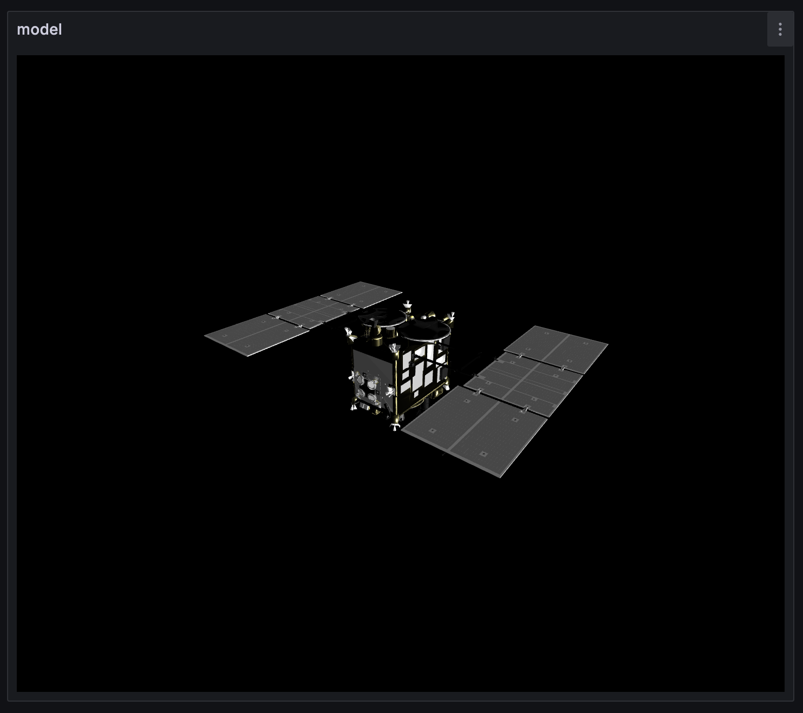
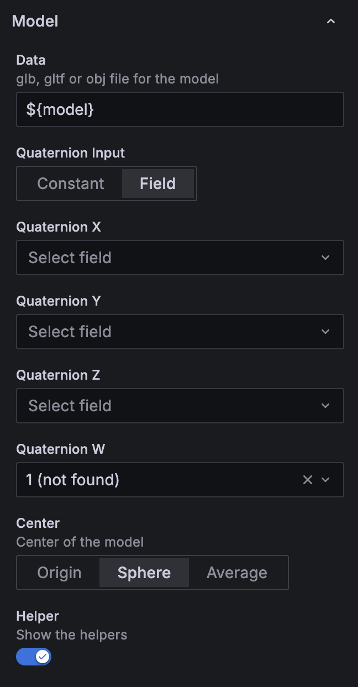
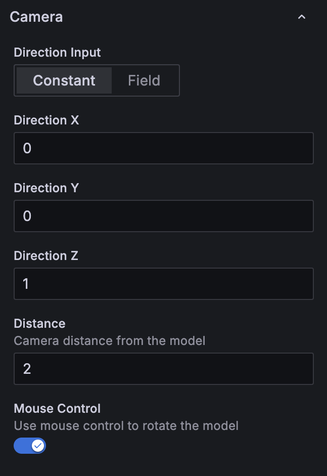

# Grafana 用 Attitude 3D Panel

WebGL を用いて Grafana ダッシュボード上に 3D モデルを描画するパネルです。宇宙機の姿勢監視やロボットの姿勢可視化など、リアルタイムに変化するクォータニオンを使った表示に適しています。

## 特長

- GLB / GLTF / OBJ アセットを読み込み、クォータニオンをテレメトリにひも付け可能。
- カメラ方向・距離・マウス制御を細かく調整して、検証やデモに対応。
- 指向性ライトと環境光を組み合わせ、視認性に合わせたライティングを構築。
- 原点・バウンディング球中心・頂点平均を切り替え、座標系の違いに柔軟に対応。

## インストール手順

1. 依存パッケージを `pnpm install` で取得します。
2. `pnpm build` でパネルをビルドします。
3. 生成されたフォルダを Grafana のプラグインディレクトリに配置 (開発時はシンボリックリンクも可)。
4. 必要に応じて Grafana 側で未署名プラグインを有効化します。

## 利用の流れ

- **モデルアセットの登録**: Grafana から到達可能な場所へ `.glb`, `.gltf`, `.obj` を配置し、URL にはテンプレート変数も利用できます。CORS の Preflight Request に応答するサーバである必要があります。
- **クォータニオンの接続**: 姿勢を固定する場合は Constant、データソースから取得する場合は Field を選びます。
- **中心位置の調整**: 原点・バウンディング球中心・頂点平均を切り替えてモデルの重心を合わせます。
- **カメラ調整**: 方向ベクトルと相対距離 (最遠頂点が 1) を設定し、表示範囲と視点を整えます。
- **ライティング設定**: 指向性ライトと環境光の色・強度・向きを調整し、モデルの陰影を制御します。
- **ヘルパーとマウス制御**: デバッグ時はヘルパー軸を表示し、レビュー用途にはマウス制御を有効化します。

## パネルオプション

### Model

*パネル表示: モデルデータの指定、クォータニオン入力方法、ヘルパー表示の設定を行います。*

- **Data**: GLB / GLTF / OBJ の URL またはテンプレート変数。CORS に対応したサーバが必要です。
- **Quaternion Input**: クォータニオンを *Constant* または *Field* で与えます。
- **Quaternion X / Y / Z / W**: 適用するクォータニオンの各成分。
- **Center**: 原点、バウンディング球中心、頂点平均からモデルの中心を指定。
- **Helper**: ヘルパー軸を表示して回転前の座標軸を確認します。

### Camera

*パネル表示: カメラ方向を定数またはフィールドで与え、相対距離とマウス制御の可否を設定します。*

- **Direction Input**: カメラ方向を定数またはデータフィールドから取得します。
- **Direction X / Y / Z**: カメラ方向ベクトルの各成分。
- **Distance**: モデルからの相対距離 (中心から最遠頂点までを 1 とするスケール)。
- **Mouse Control**: オービットコントロールによるマウス操作を有効にします。

### Directional Light

*パネル表示: 指向性ライトと環境光の方向・強度・色を調整します。*

- **Direction Input**: 光源方向を定数またはフィールドから選択。
- **Direction X / Y / Z**: 指向性ライトの方向ベクトル。
- **Color / Intensity**: ライトの色と強度を設定します。

### Ambient Light

- **Color / Intensity**: 環境光の色と強度を調整します。

### Background / Helper

- **Background Color**: 背景色または透過背景を指定します。
- **Helper Axes**: ヘルパー軸の表示を切り替えます。

## 開発メモ

- `pnpm dev` で開発用ビルドをウォッチします。
- `pnpm test` や `pnpm playwright test` でテストを実行します。
- 配布前には Grafana のプラグイン署名ガイドラインを確認してください。

## ライセンス
GNU Lesser General Public License v3.0 の下で提供されています。

著作者: ISAS/JAXA and [NAKAHIRA, Satoshi](https://orcid.org/0000-0001-9307-046X) (© 2025)。

## 謝辞
本ソフトウェアは[株式会社アストロアーツ](https://www.astroarts.co.jp/)の協力のもと開発されました。

